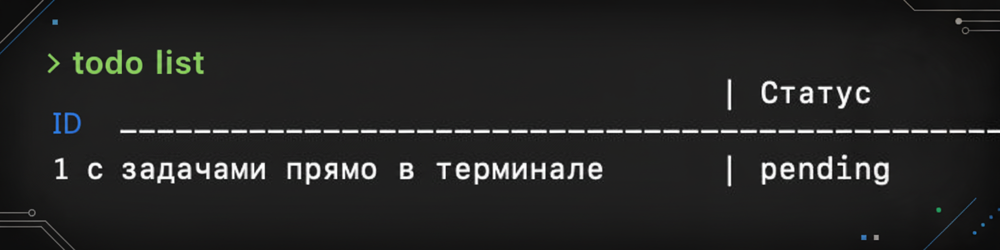

# CLI To-Do List Application



## Описание

Небольшое консольное приложение для управления задачами прямо в терминале. 

Позволяет создавать, редактировать, просматривать и удалять задачи, а также отслеживать их статусы и получать статистику.

## Возможности

- Создание задач с заголовком и описанием
- Просмотр списка всех задач или фильтрация по статусу
- Детальный просмотр конкретной задачи
- Редактирование заголовка и описания задачи
- Управление статусами: `pending` → `in_progress` → `completed`
- Поиск задач по ключевым словам
- Статистика по задачам
- Удаление задач
- Хранение данных в JSON файле

## Установка

```bash
# Клонировать репозиторий и установить зависимости
go mod download

# Собрать приложение
go build -o todo

# Или запустить напрямую
go run main.go
```

## Использование

```bash
# Общая справка по командам
todo --help

# Справка по конкретной команде
todo list --help
todo add --help
```

## Профилирование и бенчмарки

> проводить перед рефакторингом, чтобы была наглядная разница в утилизации ресурсов

Запуск бенчмарков

```go
go test -bench=. -cpuprofile=cpu.prof -benchmem 
```

```bash
BenchmarkCreateTasks-8            200637               110020 ns/op          149 B/op          2 allocs/op
BenchmarkEditTasks-8            33483076                35.03 ns/op            8 B/op          1 allocs/op
BenchmarkStartTasks-8           22942174                53.97 ns/op            8 B/op          1 allocs/op
BenchmarkCompletetTasks-8       22528370                58.73 ns/op            8 B/op          1 allocs/op
BenchmarkDeletetTasks-8         12307267                91.64 ns/op           72 B/op          3 allocs/op
BenchmarkShowTasks-8           100000000                10.42 ns/op            8 B/op          1 allocs/op
BenchmarkListTasks-8           401729164                2.964 ns/op            0 B/op          0 allocs/op
BenchmarkSearchTasks-8           5326082                223.9 ns/op           56 B/op          4 allocs/op
BenchmarkStatsTasks-8           11133528                108.9 ns/op          336 B/op          2 allocs/op
```

```go
go tool pprof cpu.prof
(pprof) top10
```

```bash
(pprof) top10
Showing nodes accounting for 26.41s, 87.16% of 30.30s total
Dropped 138 nodes (cum <= 0.15s)
Showing top 10 nodes out of 80
      flat  flat%   sum%        cum   cum%
    17.06s 56.30% 56.30%     18.30s 60.40%  todo_cli/internal/manager.(*Manager).Create
     3.41s 11.25% 67.56%      3.41s 11.25%  runtime.madvise
     2.29s  7.56% 75.12%      2.29s  7.56%  runtime.kevent
     1.08s  3.56% 78.68%      1.08s  3.56%  runtime.asyncPreempt
     0.63s  2.08% 80.76%      0.98s  3.23%  internal/runtime/maps.(*Map).getWithoutKeySmallFastStr
     0.59s  1.95% 82.71%      0.73s  2.41%  todo_cli/internal/manager.(*Manager).List
     0.40s  1.32% 84.03%      0.40s  1.32%  runtime.pthread_cond_signal
     0.38s  1.25% 85.28%      0.38s  1.25%  unicode.lookupCaseRange
     0.32s  1.06% 86.34%      0.32s  1.06%  aeshashbody
     0.25s  0.83% 87.16%      0.41s  1.35%  runtime.mallocgcTiny
```

## Тестирование

Запуск всех тестов

```go
go test ./...
```

> добавьте аргумент `-v` если нужен детальный вывод

Для просмотра покрытия тестами пакетов

```go
go test -cover ./...
```

Более детальный отчет в `html`

```go
go test -coverprofile=coverage.out ./...
go tool cover -html=coverage.out
```
